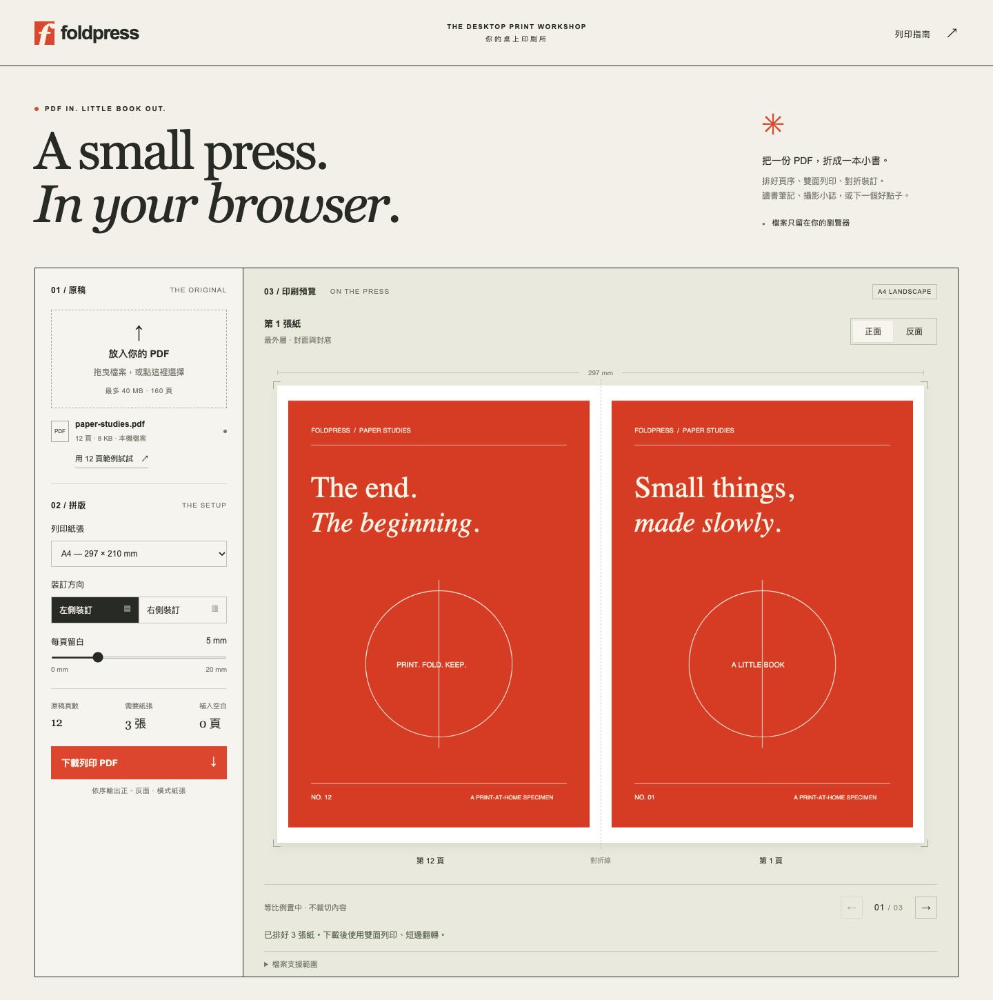

# Foldpress

一份 PDF，一台雙面印表機，一本小書。

Foldpress 把一般 PDF 重新排列成騎馬釘小冊：補齊四的倍數、安排每張紙的正反面、等比例置中，再輸出可列印的 PDF。攝影小誌、講義、讀書筆記，都可以從同一張桌子開始。

[開啟 Foldpress](https://miiduoa.github.io/foldpress/) · [設計與實作取捨](docs/decisions.md)



## 在瀏覽器裡完成

- 拖入 PDF，或直接操作內建的 12 頁範例。
- 選 A4、A3 或 Letter，設定左／右裝訂與 0–20 mm 留白。
- 檢查每張紙的正反面。預覽由**即將下載的同一份 PDF** 渲染。
- 下載後以橫式、實際大小、雙面短邊翻轉列印，再依序套疊、對折、裝訂。

所有 PDF 處理都在本機瀏覽器記憶體中。沒有帳號、檔案上傳、分析追蹤或外部字型；重新整理會清除原稿。部署主機仍會收到載入網頁與靜態程式檔的正常請求。

## 本機執行

需要 Node.js 22.13+（22.x）、24.x 或 26+；CI 使用 Node.js 24。

```sh
npm ci
npm run dev
```

開啟終端機顯示的 `/foldpress/` 網址。

```sh
npm test
npm run build
npm run preview
```

依賴版本與 lockfile 一併固定。靜態建置目錄為 `dist/`，Vite base 為 `/foldpress/`。如變更部署路徑，也需調整 `vite.config.ts` 與 `index.html` 的 favicon 路徑。

## 頁序

12 頁、左側裝訂的小冊需要 3 張紙：

| 紙張（由外到內） | 正面左／右 | 反面左／右 |
| ---------------- | ---------- | ---------- |
| 1                | 12 / 1     | 2 / 11     |
| 2                | 10 / 3     | 4 / 9      |
| 3                | 8 / 5      | 6 / 7      |

右側裝訂會交換每一面的左右頁。非四的倍數補空白；輸出順序是第 1 張正面、第 1 張反面、第 2 張正面……。印表機中不要再啟用「小冊子」拼版，避免重複排列。

## 支援與限制

- 上限 40 MB、160 頁。這是處理上限，不是建議裝訂厚度；頁數多時，請先拆成幾本較薄的小冊。
- 支援混合尺寸、CropBox 裁切與 0/90/180/270 度旋轉。內容等比例縮放，不裁切以填滿版面。
- 不接受加密 PDF、未壓平表單（含 XFA）或非連結註解。請先另存／列印成平面 PDF。
- PDF 連結的互動區與外框不會輸出；正文中的連結文字會保留。
- 不支援自訂 UserUnit、超出 MediaBox 的裁切範圍、分帖、爬移補償、出血或印刷廠色彩管理。
- PDF 頁面 artwork 會重新嵌入；文件書籤、附件、無障礙標記與原稿中繼資料不會沿用。這是列印檔，不適合取代原稿封存。
- 面對極度複雜的向量或高解析圖片，瀏覽器仍可能耗用大量記憶體。檔案大小限制不能保證解析成本。
- 現代瀏覽器，需要 JavaScript、Web Worker 與 Canvas。沒有 service worker，因此不宣稱離線啟動支援。
- 列印方向與出紙順序依印表機而異。第一次請先印一張紙，確認翻轉方向。

## 專案結構

```text
src/imposition.ts    頁序、輸入驗證、裁切與旋轉處理、PDF 輸出
src/sample.ts        原創 12 頁 Paper studies 範例
src/main.ts          檔案匯入、版本控制、預覽與下載
src/style.css        排版、紙張工作台與響應式介面
tests/               頁序不變量與實際 PDF 內容測試
```

`npm test` 同時檢查所有支援頁數的排列不變量，以及 PDF.js 讀回的實際輸出內容、頁面尺寸、左右位置、直角旋轉、非零裁切原點與空白頁。測試不代表實體印表機已驗證。

GitHub Pages workflow 會先跑測試與建置，再部署 `main`。首次使用需在儲存庫 Settings → Pages 選擇 GitHub Actions。

[設計與實作取捨](docs/decisions.md) · [MIT License](LICENSE)
